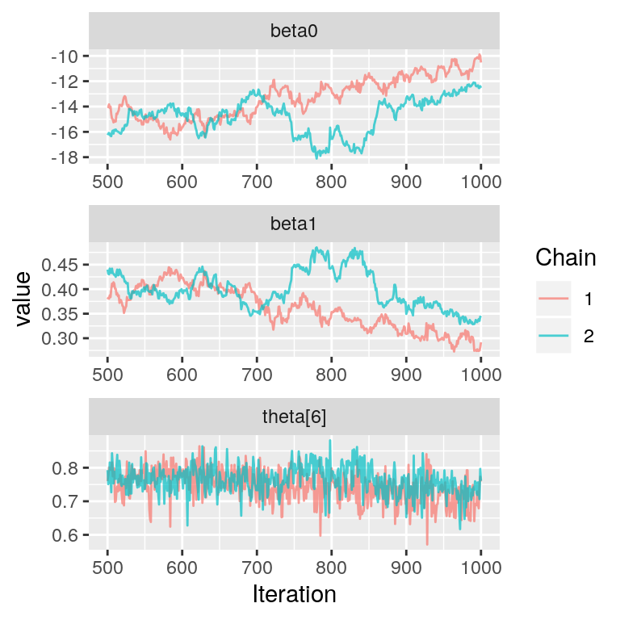
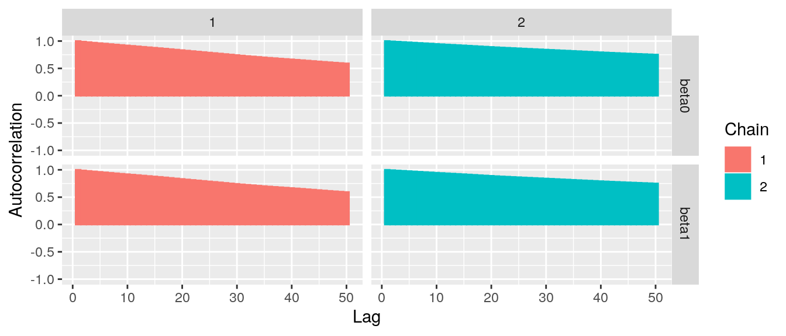

```{r setup, include=FALSE}
library(tufte)
# invalidate cache when the tufte version changes
knitr::opts_chunk$set(tidy = FALSE, cache.extra = packageVersion('tufte'))
options(htmltools.dir.version = FALSE)
options(scipen=999)
```


## Parametric Survival Analysis Model (in a Bayesian way)


```{marginfigure}
Weibull Survival funciton in a proportional hazard way expression is:
$$S(t | \mathbf{x}) = \exp\{ -\lambda t ^\kappa e^{\mathbf{\beta_{PH}^T x}} \}$$
```

```{marginfigure}
Weibull Survival funciton in a AFT way expression is:
$$S(t | \mathbf{x}) = \exp\{ -\lambda t ^\kappa e^{\kappa\mathbf{\beta_{AFT}^T x}} \}$$
```


- We chose Weibull model to describe the survival data we have.

- Weibull model is both a proportional hazard model and a accelerated failure time (AFT) model. The relationship between the acceleration factor and log hazard ratio:

$$
\exp(\beta^T_{PH}) = \exp(\kappa\beta^T_{AFT})
$$

```{marginfigure}
Acceleration factor is the factor by which time to failure/event is accelerated for $x_1 = 1$ compared with $x_1 = 0$
```


## An example of a crude Weibull model using the JAGS program in R:

```{r modeljag, eval=FALSE}
jacc.weibull.model <- function() {
  for(i in 1:39386){# loop through the subjects
    # sAge[i] <- (Age[i] - mean(Age[])) / sd(Age[])
    is.censored[i] ~ dinterval(t[i], c[i])
    t[i] ~ dweib(shape, lambda[i])
    lambda[i] <- exp(-mu[i] * shape)
    mu[i] <- beta[1] + beta[2]*equals(Mlkfre[i], 2) +
      beta[3]*equals(Mlkfre[i], 3) + beta[4] * equals(Mlkfre[i], 4) +
      beta[5] * equals(Mlkfre[i], 5) # + 
      # beta[6] * sAge[i]
    
    ### calculate log-likelihoods
    # y[i] <- ifelse(is.censored[i], c[i], t[i])
    # loglik[i] <- log(ifelse(is.censored[i],
    #                  exp(-lambda[i] * (y[i] ^ shape)),
    #               shape * lambda[i] * (y[i] ^ (shape - 1)) * exp(-lambda[i] * (y[i] ^ shape))))
  }
  
  ## priors for betas
  for(j in 1:5){
    beta[j] ~ dnorm(0, 0.001)
  }
  
  ### prior for shape
  shape ~ dgamma(.001, .001)
  
  ### Generated values
  AFT[2] <- exp(beta[2])
  HR[2] <- exp(shape * beta[2])
  p.crit[2] <- step(1 - HR[2])
  
  AFT[3] <- exp(beta[3])
  HR[3] <- exp(shape * beta[3])
  p.crit[3] <- step(1 - HR[3])
  
  AFT[4] <- exp(beta[4])
  HR[4] <- exp(shape * beta[4])
  p.crit[4] <- step(1 - HR[4])
  
  AFT[5] <- exp(beta[5])
  HR[5] <- exp(shape * beta[5])
  p.crit[5] <- step(1 - HR[5])
}
```

You can use the following codes to run the above model (careful about the cost of time):

```{r eval=FALSE}
library(R2jags) #conect to jags sampling engine in R
jagsfit <- jags.parallel(data = JACCdata,
                         parameters.to.save = c("beta[5]", "HR[5]", "AFT[5]"),
                         #add more variables if you want to check more
                         n.iter = 10000, 
                         n.burnin = 2500, 
                         n.chains = 3,
                         model.file = jacc.weibull.model)
```


The output of the above crude Weibull model: 

```{r echo=FALSE, message=FALSE, warning=FALSE}
load("../data/jagmodel0men.Rdata")
# summary(mcmcplots::convert.mcmc.list(jagsfit))
# Simulated <- coda::as.mcmc(jagsfit)
Simulated <- mcmcplots::as.mcmc.bugs(jagsfit$BUGSoutput)
library(ggmcmc)
ggSample <- ggs(Simulated)
# jagsfit$BUGSoutput
```

```
# Inference for Bugs model at "jacc.weibull.model", fit using jags,
#  3 chains, each with 10000 iterations (first 2500 discarded), n.thin = 7
#  n.sims = 3213 iterations saved. Sample size per chain = 1071 
# 1. Empirical mean and standard deviation for each variable,
#    plus standard error of the mean:
#                   Mean        SD   Naive SE Time-series SE
# AFT[2]        0.922303  0.064441 0.00113685     0.00420403
# AFT[3]        0.834723  0.051485 0.00090830     0.00362857
# AFT[4]        0.848329  0.052439 0.00092513     0.00401102
# AFT[5]        0.928095  0.041834 0.00073803     0.00336613
# HR[2]         0.890533  0.090586 0.00159811     0.00604246
# HR[3]         0.769913  0.069116 0.00121934     0.00486858
# HR[4]         0.788205  0.070624 0.00124594     0.00531505
# HR[5]         0.897882  0.058477 0.00103164     0.00468654
# p.crit[2]     0.871460  0.334743 0.00590548     0.01814848
# p.crit[3]     0.996265  0.061008 0.00107630     0.00214585
# p.crit[4]     0.998133  0.043180 0.00076177     0.00097572
# p.crit[5]     0.953626  0.210327 0.00371056     0.02050164
# 2. Quantiles for each variable:
#                   2.5%          25%          50%         75%       97.5%
# AFT[2]        0.807308     0.876649     0.918049     0.96495     1.05225
# AFT[3]        0.738423     0.799925     0.832078     0.86719     0.94214
# AFT[4]        0.749645     0.810952     0.847050     0.88448     0.95291
# AFT[5]        0.847796     0.899999     0.927850     0.95594     1.01147
# HR[2]         0.733186     0.825541     0.883106     0.94896     1.07725
# HR[3]         0.644053     0.721892     0.765778     0.81289     0.91643
# HR[4]         0.658787     0.737562     0.785538     0.83614     0.93282
# HR[5]         0.788623     0.857453     0.896668     0.93613     1.01665
# ...
```

## Check model fitting: 


```{r echo=FALSE, fig.height=4.5, fig.width=5, message=FALSE, warning=FALSE, fig.cap="Traceplot for AFT, and HR of daily milk drinkers from crude model (men)."}
library(tidyverse)
ggSample %>% 
  filter(Iteration >= 120 & Parameter %in% c("beta[5]", "HR[5]", "AFT[5]")) %>% 
  ggs_traceplot()
```

```{r badtrace, echo=FALSE, out.width = '90%', cache=TRUE, fig.cap="Not overlapping traceplot indicating that model is not converged.",fig.align='center', fig.margin = TRUE}

```


<!-- ```{marginfigure} -->
<!-- Overlapping of the posterior sampling chains is good. -->
<!-- ``` -->


```{r echo=FALSE, fig.height=4.5, fig.width=5, message=FALSE, warning=FALSE, fig.cap="Autocorrelation figures for AFT, and HR of daily milk drinkers from crude model (men)."}

ggSample %>% 
  filter(Iteration >= 120 & Parameter %in% c("beta[5]", "HR[5]", "AFT[5]")) %>% 
  ggs_autocorrelation()
```

```{r badauto, echo=FALSE, out.width = '90%', cache=TRUE, fig.cap="(bad example)Highly correlated posterior samples indicating that the samples are not independent.",fig.align='center', fig.margin = FALSE}

```

<!-- We can report the above findings as:  -->

```{r tab1, echo=FALSE, eval=FALSE, message=FALSE}
library(knitr)
library(kableExtra)
dt <- read.csv("tab/HRAFTweib.csv", header = T)
names(dt) <- c("Milk intake", "Median", "Mean (SD)", "95% CrI", "MCSE", "Probability", "Median", "Mean (SD)", "95% CrI", "MCSE")
kable(dt, format = "latex", caption = "", booktabs = T,linesep = "") %>%
kable_styling(latex_options = c("striped","hold_position"), font_size = 8) %>%
  add_header_above(c(" ", "Hazard ratio (HR)" = 5, "Acceleration factor (AF)" = 4)) %>% 
  footnote(c("Abbreviations: SD, standard deviation; CrI, credible interval; MCSE, Monte Carlo Standard Error;", " Probability indicates that the p for HR smaller than 1."))
```


\begin{table}[!htbp]
Table 1. Estimated (crude) hazard ratios and acceleration factors for the association of milk intake and risk of stroke mortality using Bayesian MCMC methods in Men of the JACC study data (n = 39,386).

\centering
\fontsize{8}{10}\selectfont
\begin{tabular}[t]{llllllllll}
\toprule
\multicolumn{1}{c}{ } & \multicolumn{5}{c}{Hazard ratio (HR)} & \multicolumn{4}{c}{Acceleration factor (AF)} \\
\cmidrule(l{3pt}r{3pt}){2-6} \cmidrule(l{3pt}r{3pt}){7-10}
Milk intake & Median & Mean (SD) & 95\% CrI & MCSE & Probability & Median & Mean (SD) & 95\% CrI & MCSE\\
\midrule
\rowcolor{gray!6}  Never & - & - & - & - & - & - & - & - & -\\
1-2 t/Mon & 0.88 & 0.89 (0.09) & (0.73, 1.08) & 0.0016 & 87.15\% & 0.92 & 0.92 (0.06) & (0.81, 1.06) & 0.0011\\
\rowcolor{gray!6}  1-2 t/Week & 0.77 & 0.77 (0.07) & (0.64, 0.92) & 0.0012 & 99.63\% & 0.83 & 0.83 (0.05) & (0.74, 0.94) & 0.0009\\
3-4 t/Week & 0.79 & 0.79 (0.07) & (0.66, 0.93) & 0.0012 & 99.81\% & 0.85 & 0.85 (0.05) & (0.75, 0.95) & 0.0009\\
\rowcolor{gray!6}  Daily & 0.89 & 0.90 (0.06) & (0.79, 1.02) & 0.0010 & 95.36\% & 0.93 & 0.93 (0.04) & (0.85, 1.01) & 0.0007\\
\bottomrule
\multicolumn{10}{l}{\textit{Note: }}\\
\multicolumn{10}{l}{Abbreviations: SD, standard deviation; CrI, credible interval; MCSE, Monte Carlo Standard Error;}\\
\multicolumn{10}{l}{ Probability indicates that p for HR smaller than 1.}\\
\end{tabular}
\end{table}


```{r echo=FALSE, fig.height=6, fig.width=6, message=FALSE, warning=FALSE, fig.cap="Crude model HR posterior density plots."}
par(mfrow = c(2,2))
# HR2
HR2 <- ggSample %>% 
  filter(Parameter == "HR[2]")
denHR5 <- density(HR2$value)
plot(denHR5, main = "HR2 posterior density plot \n (shaded area = 0.8715).", 
     ylab = "P(HR2)", xlab = "HR2 (1-2 t/Mon drinker against never)", col = "black")

qn1   <- 1
qn02   <- -0.2


x3 <- min(which(denHR5$x >= qn02))  
x4 <- max(which(denHR5$x <  qn1))

with(denHR5, polygon(x=c(x[c(x3,x3:x4,x4)]), y= c(0, y[x3:x4], 0), col="gray"))

# HR3
HR2 <- ggSample %>% 
  filter(Parameter == "HR[3]")
denHR5 <- density(HR2$value)
plot(denHR5, main = "HR3 posterior density plot \n (shaded area = 0.9963).", 
     ylab = "P(HR3)", xlab = "HR3 (1-2 t/Week drinker against never)", col = "black")

qn1   <- 1
qn02   <- -0.2


x3 <- min(which(denHR5$x >= qn02))  
x4 <- max(which(denHR5$x <  qn1))

with(denHR5, polygon(x=c(x[c(x3,x3:x4,x4)]), y= c(0, y[x3:x4], 0), col="gray"))

# HR4 
HR2 <- ggSample %>% 
  filter(Parameter == "HR[4]")
denHR5 <- density(HR2$value)
plot(denHR5, main = "HR4 posterior density plot \n (shaded area = 0.9981).", 
     ylab = "P(HR4)", xlab = "HR4 (3-4 t/Week drinker against never)", col = "black")

qn1   <- 1
qn02   <- -0.2


x3 <- min(which(denHR5$x >= qn02))  
x4 <- max(which(denHR5$x <  qn1))

with(denHR5, polygon(x=c(x[c(x3,x3:x4,x4)]), y= c(0, y[x3:x4], 0), col="gray"))

# HR5
HR5 <- ggSample %>% 
  filter(Parameter == "HR[5]")
denHR5 <- density(HR5$value)
plot(denHR5, main = "HR5 posterior density plot \n (shaded area = 0.9536)", 
     ylab = "P(HR5)", xlab = "HR5 (daily drinker against never)", col = "black")

qn1   <- 1
qn02   <- -0.2


x3 <- min(which(denHR5$x >= qn02))  
x4 <- max(which(denHR5$x <  qn1))

with(denHR5, polygon(x=c(x[c(x3,x3:x4,x4)]), y= c(0, y[x3:x4], 0), col="gray"))

```

```{r echo=FALSE, fig.height=3, fig.width=4, message=FALSE, warning=FALSE, fig.cap="HR5 posterior density plot (shaded area = 0.9536).", eval=FALSE}
HR5 <- ggSample %>% 
  filter(Parameter == "HR[5]")
denHR5 <- density(HR5$value)
plot(denHR5, main = "HR5 posterior density plot", 
     ylab = "P(HR5)", xlab = "HR5 (daily drinker against never)", col = "black")

qn1   <- 1
qn02   <- -0.2


x3 <- min(which(denHR5$x >= qn02))  
x4 <- max(which(denHR5$x <  qn1))

with(denHR5, polygon(x=c(x[c(x3,x3:x4,x4)]), y= c(0, y[x3:x4], 0), col="gray"))
```

```{r tab2, echo=FALSE, eval=FALSE, message=FALSE}
library(knitr)
library(kableExtra)
dt <- read.csv("tab/HRAFTweibM1.csv", header = T)
names(dt) <- c("Milk intake", "Median", "Mean (SD)", "95% CrI", "MCSE", "Probability", "Median", "Mean (SD)", "95% CrI", "MCSE")
kable(dt, format = "latex", caption = "", booktabs = T,linesep = "") %>%
kable_styling(latex_options = c("striped","hold_position"), font_size = 8) %>%
  add_header_above(c(" ", "Hazard ratio (HR)" = 5, "Acceleration factor (AF)" = 4)) %>% 
  footnote(c("Abbreviations: SD, standard deviation; CrI, credible interval; MCSE, Monte Carlo Standard Error;", " Probability indicates that the p for HR smaller than 1."))
```

\begin{table}[!htbp]
Table 2. Estimated (age-adjusted) hazard ratios and acceleration factors for the association of milk intake and risk of stroke mortality using Bayesian MCMC methods in Men of the JACC study data (n = 39,386).

\centering
\fontsize{8}{10}\selectfont
\begin{tabular}[t]{llllllllll}
\toprule
\multicolumn{1}{c}{ } & \multicolumn{5}{c}{Hazard ratio (HR)} & \multicolumn{4}{c}{Acceleration factor (AF)} \\
\cmidrule(l{3pt}r{3pt}){2-6} \cmidrule(l{3pt}r{3pt}){7-10}
Milk intake & Median & Mean (SD) & 95\% CrI & MCSE & Probability & Median & Mean (SD) & 95\% CrI & MCSE\\
\midrule
\rowcolor{gray!6}  Never & - & - & - & - & - & - & - & - & -\\
1-2 t/Mon & 0.98 & 0.98 (0.11) & (0.78, 1.19) & 0.0018 & 57.86\% & 0.98 & 0.99 (0.06) & (0.87, 1.11) & 0.0011\\
\rowcolor{gray!6}  1-2 t/Week & 0.84 & 0.84 (0.08) & (0.69, 0.99) & 0.0014 & 97.79\% & 0.90 & 0.90 (0.05) & (0.80, 0.99) & 0.0008\\
3-4 t/Week & 0.86 & 0.86 (0.08) & (0.71, 1.02) & 0.0014 & 95.92\% & 0.91 & 0.91 (0.05) & (0.82, 1.01) & 0.0009\\
\rowcolor{gray!6}  Daily & 0.75 & 0.75 (0.05) & (0.67, 0.85) & 0.0009 & 100.00\% & 0.85 & 0.85 (0.03) & (0.79, 0.91) & 0.0006\\
\bottomrule
\multicolumn{10}{l}{\textit{Note: }}\\
\multicolumn{10}{l}{Abbreviations: SD, standard deviation; CrI, credible interval; MCSE, Monte Carlo Standard Error;}\\
\multicolumn{10}{l}{ Probability indicates the p for HR smaller than 1.}\\
\end{tabular}
\end{table}


```{r echo=FALSE, fig.height=6, fig.width=6, message=FALSE, warning=FALSE, fig.cap="Age-adjusted HR posterior density plots."}
load("../data/jagmodel1Agemen.Rdata")
# summary(mcmcplots::convert.mcmc.list(jagsfit))
# Simulated <- coda::as.mcmc(jagsfit)
Simulated <- mcmcplots::as.mcmc.bugs(jagsfit$BUGSoutput)
library(ggmcmc)
ggSample <- ggs(Simulated)

par(mfrow = c(2,2))
# HR2
HR2 <- ggSample %>% 
  filter(Parameter == "HR[2]")
denHR5 <- density(HR2$value)
plot(denHR5, main = "HR2 posterior density plot \n (shaded area = 0.5786).", 
     ylab = "P(HR2)", xlab = "HR2 (1-2 t/Mon drinker against never)", col = "black")

qn1   <- 1
qn02   <- -0.2


x3 <- min(which(denHR5$x >= qn02))  
x4 <- max(which(denHR5$x <  qn1))

with(denHR5, polygon(x=c(x[c(x3,x3:x4,x4)]), y= c(0, y[x3:x4], 0), col="gray"))

# HR3
HR2 <- ggSample %>% 
  filter(Parameter == "HR[3]")
denHR5 <- density(HR2$value)
plot(denHR5, main = "HR3 posterior density plot \n (shaded area = 0.9779).", 
     ylab = "P(HR3)", xlab = "HR3 (1-2 t/Week drinker against never)", col = "black")

qn1   <- 1
qn02   <- -0.2


x3 <- min(which(denHR5$x >= qn02))  
x4 <- max(which(denHR5$x <  qn1))

with(denHR5, polygon(x=c(x[c(x3,x3:x4,x4)]), y= c(0, y[x3:x4], 0), col="gray"))

# HR4 
HR2 <- ggSample %>% 
  filter(Parameter == "HR[4]")
denHR5 <- density(HR2$value)
plot(denHR5, main = "HR4 posterior density plot \n (shaded area = 0.9592).", 
     ylab = "P(HR4)", xlab = "HR4 (3-4 t/Week drinker against never)", col = "black")

qn1   <- 1
qn02   <- -0.2


x3 <- min(which(denHR5$x >= qn02))  
x4 <- max(which(denHR5$x <  qn1))

with(denHR5, polygon(x=c(x[c(x3,x3:x4,x4)]), y= c(0, y[x3:x4], 0), col="gray"))

# HR5
HR5 <- ggSample %>% 
  filter(Parameter == "HR[5]")
denHR5 <- density(HR5$value)
plot(denHR5, main = "HR5 posterior density plot \n (shaded area = 1.0)", 
     ylab = "P(HR5)", xlab = "HR5 (daily drinker against never)", col = "black")

qn1   <- 1
qn02   <- -0.2


x3 <- min(which(denHR5$x >= qn02))  
x4 <- max(which(denHR5$x <  qn1))

with(denHR5, polygon(x=c(x[c(x3,x3:x4,x4)]), y= c(0, y[x3:x4], 0), col="gray"))

```